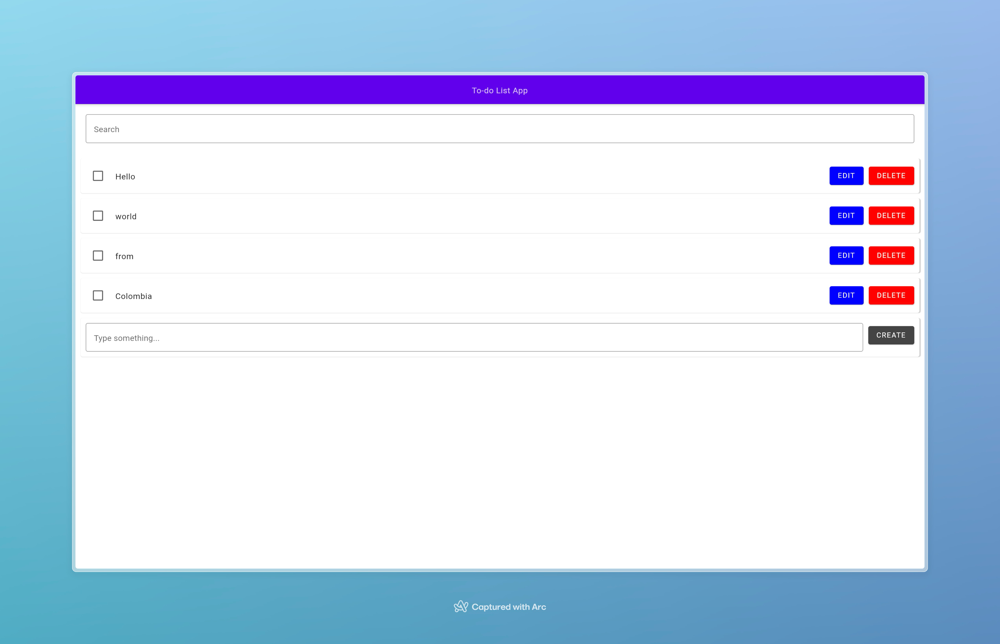

# KW Todo

A Kotlin Wasm Todo Application. Built with Kotlin Multiplatform with Wasm as the only target in mind. The main goal is
to try Kotlin Multiplatform for web, specifically for Wasm, to build a very simple app.

## Features

- Create
- List
- Update
- Delete
- Search

## Screenshots

## Stack

- Kotlin
- Compose Multiplatform
- Ktor
- SQLDelight - SQLite

## Modules

The application is totally written in Kotlin. Each module has their own responsibilities, as described here:

- database: SQLDelight bindings and database configuration.
- server: Ktor server and application's logic
- composeApp: Compose Multiplatform UI and Wasm setup
- shared: Domain models

### About Wasm

Despite Kotlin Wasm is still
in [Alpha](https://kotlinlang.org/docs/components-stability.html#current-stability-of-kotlin-components), I decided to
give it a try
to [Compose Multiplatform for Web](https://github.com/Kotlin/kotlin-wasm-examples/tree/main/compose-imageviewer#compose-multiplatform-for-web)
and build this small app for exploration.

## Running in development

### Requisites

- JDK 17

### Setting up the database

This project uses an embedded in memory SQLite database. Once the server is started a new database is created.

### Running the server

Run `./gradlew :server:run -t` to start the Ktor server on port 8080.

### Running the Wasm application

Run `./gradlew :composeApp:wasmJsRun -t` to start the Wasm application on port 8081 (or the next
available port)